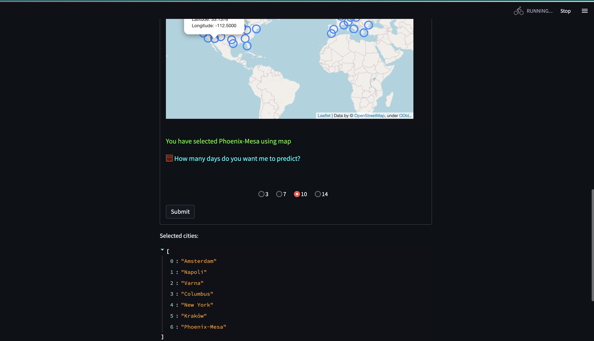
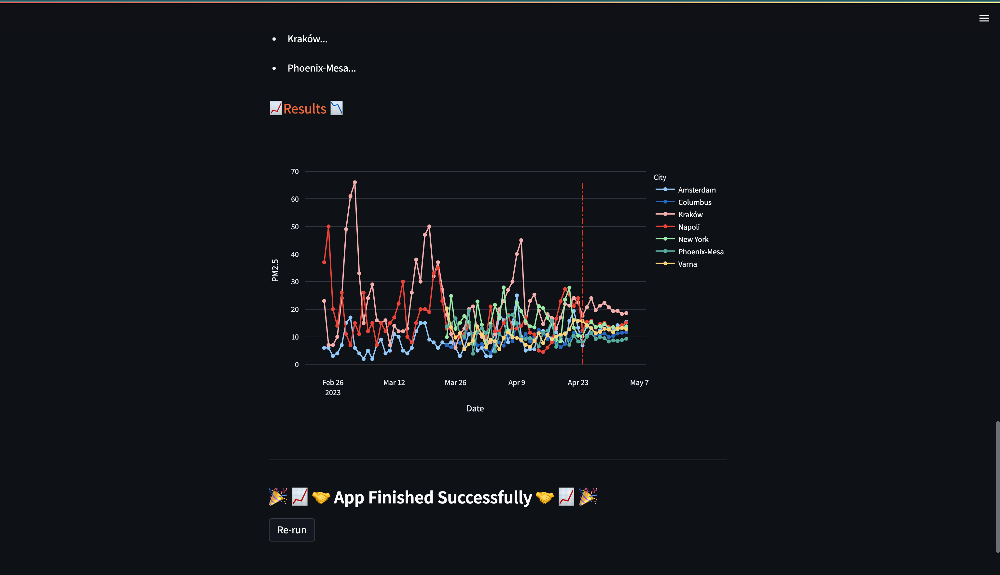
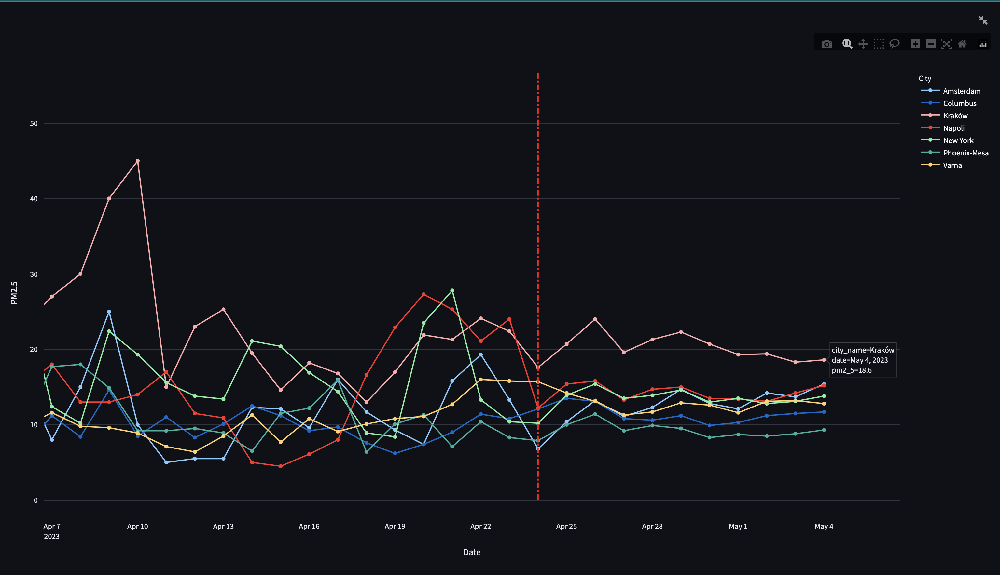

# </img> **Hopsworks Feature Store** Advanced Tutorial - Air Quality Prediction

  This is an <b>advanced example</b> of the Hopsworks <a href="https://www.hopsworks.ai/feature-store">Feature Store</a> usage; you are tasked with predicting the Air Quality value <a href="https://en.wikipedia.org/wiki/Particulates">(PM2.5)</a> in Europe and USA using weather features and air quality features of the previous days.

> The [Feature Store](https://www.hopsworks.ai/feature-store) is the essential part of AI infrastructure that helps organisations bring modern enterprise data to analytical and operational ML systems. It is the simplest most powerful way to get your models to production. From anywhere, to anywhere.
  You will load starting data into the feature store, create two feature groups from which we will make a feature view and training dataset, and train a model to predict fare amounts.
  Also, you will design a data-generating and Feature Store insertion pipeline, that will be running once a time using <b>GitHub actions</b>.

  <b>Streamlit</b> app will be created so you would be able to try your model on different cities interactively.

   This is a <b>batch use case</b>, it will give you a high-level view of how to use our python APIs and the UI to navigate the feature groups.
 

## **🗒️ This whole tutorial is divided into 5 parts:**
1. Backfill Features to the Feature Store,
2. Create a feature pipeline,
3. Create Feature view & Training Datasets, train a model and upload it to the Model Registry,
4. Deploy Streamlit app.

## Prerequisites
To run this tutorial, you need an account on Hopsworks. You can create a new account at  [app.hopsworks.ai](https://app.hopsworks.ai).
In the notebook you will be prompted with a link to generate an API token to interact with your Hopsworks account.

Also, you are required to have some python library installed (See the `requirements.txt` inside this folder).

## Data
The data for this project was collected using several different APIs. I used [European Environmental Agency](https://discomap.eea.europa.eu/map/fme/AirQualityExport.htm) to collect data on European cities, and [United States Environmental Protection Agency](https://aqs.epa.gov/aqsweb/documents/data_api.html#daily) for American cities.  Both are free and publicly available. They don't require registration or API keys. 
For the city of Seattle, I found and downloaded the data manually from [here](https://www.epa.gov/outdoor-air-quality-data/download-daily-data). 

In `feature pipeline` you will use a free [Open-Meteo](https://open-meteo.com/en/docs/air-quality-api) API that covers many places in the world (works by coordinates). 

The reason I use so many different APIs instead of just one Open-Meteo is that Open-Meteo only has data from 2022-07-29.

Anyway, as I said earlier, you don't need any registration or API keys to use any of the above APIs.

## Streamlit run
To run streamlit app (after you have run all notebooks and already have required feature groups in Feature Store and model in Model Registry), simply type:

`python -m streamlit run streamlit_app.py` on Windows

or

`python3 -m streamlit run streamlit_app.py` on Unix

## Streamlit usage examples

