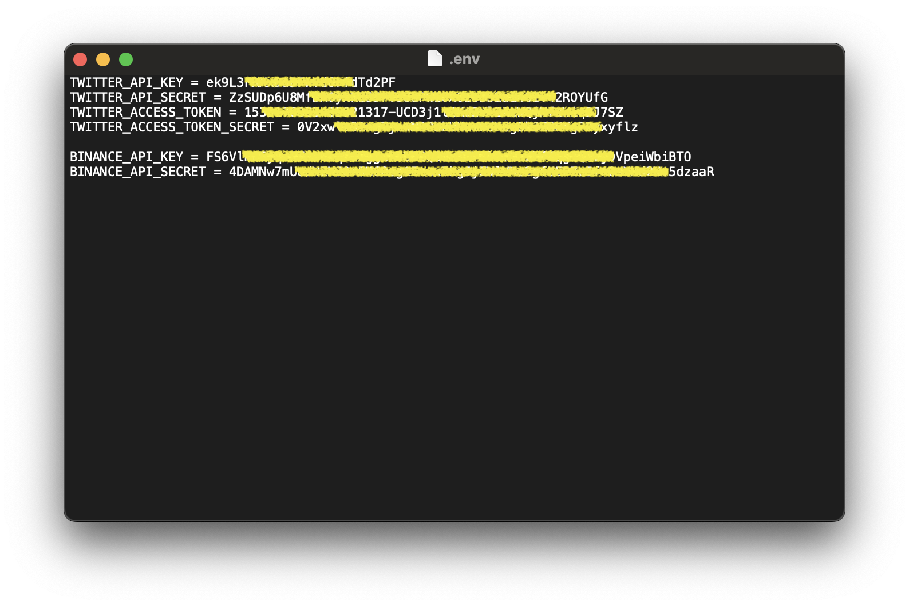

# </img> **Hopsworks Feature Store** Advanced Tutorial - Bitcoin Price Predicting

  This is an <b>advanced example</b> of the Hopsworks <a href="https://www.hopsworks.ai/feature-store">Feature Store</a> usage; you are tasked with predicting the tomorrow Bitcoin price using timeseries features, and tweets sentiment analysis.

> The [Feature Store](https://www.hopsworks.ai/feature-store) is the essential part of AI infrastructure that helps organisations bring modern enterprise data to analytical and operational ML systems. It is the simplest most powerful way to get your models to production. From anywhere, to anywhere.
  You will load starting data into the feature store, create two feature groups from which we will make a feature view and training dataset, and train a model to predict fare amounts.
  Also, you will design a data-generating and Feature Store insertion pipeline, that will be running once a time using <b>GitHub actions</b>.

  <b>Streamlit</b> app will be created so you would be able to try your model interactively.

   This is an <b>online use case</b>, you will use Hopsworks Model Registry to register the model and run online deployment, which will make prediction for you.
 

## **🗒️ This whole tutorial is divided into 5 parts:**
1. Backfill Features to the Feature Store,
2. Create a feature pipeline,
3. Create Feature views & Training Datasets,
4. Train a model and upload it to the Model Registry and run deployment,
5. Fetch model from Model Registry and make batch predictions,
6. Deploy Streamlit app.

## Prerequisites
To run this tutorial, you need an account on Hopsworks. You can create a new account at  [app.hopsworks.ai](https://app.hopsworks.ai).
In the notebook you will be prompted with a link to generate an API token to interact with your Hopsworks account.

Also, you obviously need to have [streamlit](https://docs.streamlit.io/library/get-started/installation)  python library installed.

## Data
You will parse timeseries Bitcoin data from Binance using your own credentials, so you have to get a free Binance account and [create API-keys](https://www.binance.com/en/support/faq/360002502072).

Also, you should [contact Twitter](https://developer.twitter.com/en/docs/twitter-api/getting-started/getting-access-to-the-twitter-api) for their API-keys.

Don't forget to create an `.env` configuration file where all the necessary environment variables will be stored:

## Streamlit run
To run streamlit app (after you have run all notebooks and already have required feature groups in Feature Store and model in Model Registry), simply type:

`python -m streamlit run streamlit_app.py` on Windows

or

`python3 -m streamlit run streamlit_app.py` on Unix

## Streamlit usage examples

