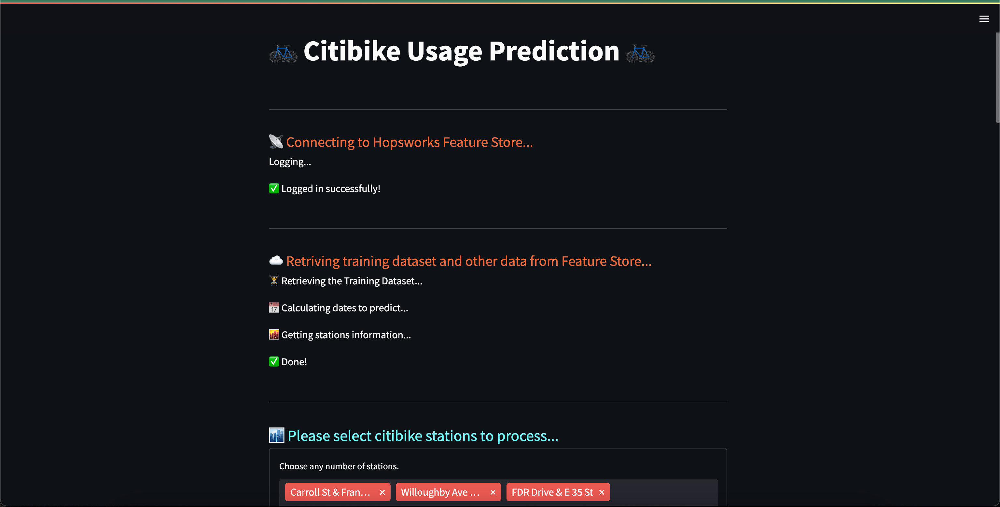
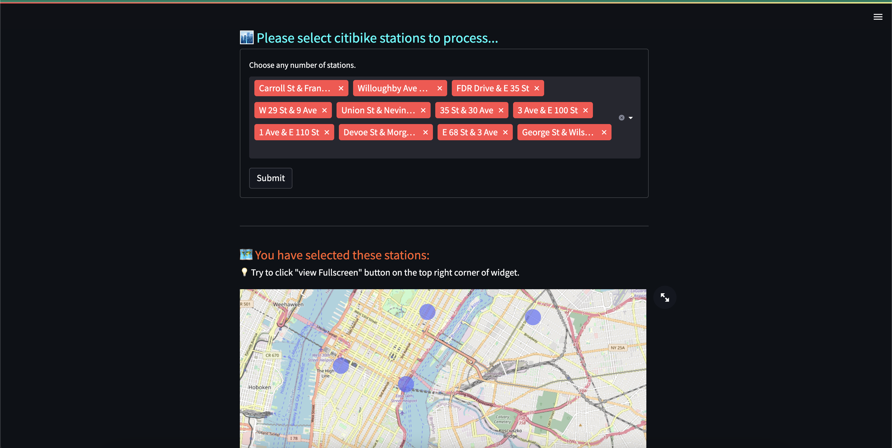
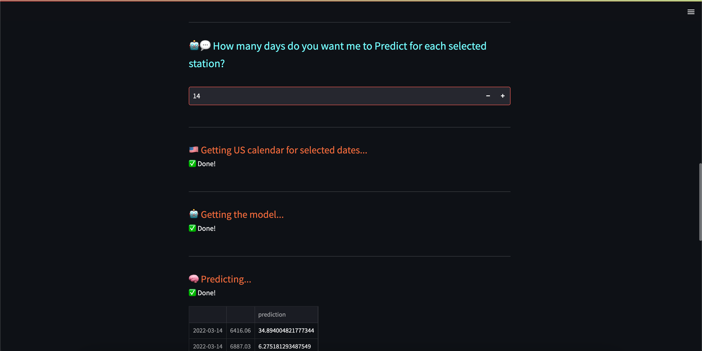
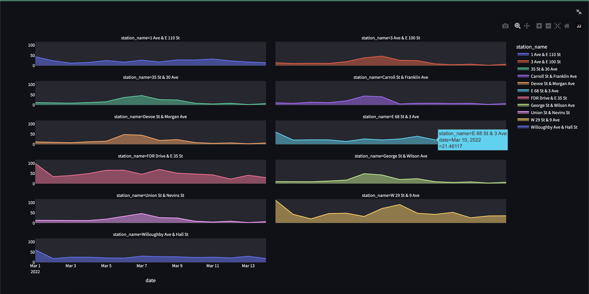

# </img> **Hopsworks Feature Store** Advanced Tutorial - Citibike Usage Prediction

  This is an <b>advanced example</b> of the Hopsworks <a href="https://www.hopsworks.ai/feature-store">Feature Store</a> usage; you are tasked with predicting the number of citibike users on each citibike station in the New York City.

> The [Feature Store](https://www.hopsworks.ai/feature-store) is the essential part of AI infrastructure that helps organisations bring modern enterprise data to analytical and operational ML systems. It is the simplest most powerful way to get your models to production. From anywhere, to anywhere.
  You will load starting data into the feature store, create two feature groups from which we will make a feature view and training dataset, and train a model to predict fare amounts.
  Also, you will design a data-generating and Feature Store insertion pipeline, that will be running once a time using <b>GitHub actions</b>.

  <b>Streamlit</b> app will be created so you would be able to try your model interactively.

   This is a <b>batch use case</b>, it will give you a high-level view of how to use our python APIs and the UI to navigate the feature groups.
 

## **🗒️ This whole tutorial is divided into 5 parts:**
1. Backfill Features to the Feature Store,
2. Create a feature pipeline,
3. Create Feature View & Training Datasets, train a model and upload it to the Model Registry,
4. Deploy Streamlit app.

## Prerequisites
To run this tutorial, you need an account on Hopsworks. You can create a new account at  [app.hopsworks.ai](https://app.hopsworks.ai).
In the notebook you will be prompted with a link to generate an API token to interact with your Hopsworks account.

Also, you obviously need to have [streamlit](https://docs.streamlit.io/library/get-started/installation)  python library installed.

## Data
You will parse weather data so you should get an API key from [VisualCrossing](https://www.visualcrossing.com/). You can use [this link](https://www.visualcrossing.com/weather-api).

Don't forget to create an `.env` configuration file where all the necessary environment variables will be stored:
> `VISUALCROSSING_API_KEY = "YOUR_API_KEY"`

## Streamlit run
To run streamlit app (after you have run all notebooks and already have required feature groups in Feature Store and model in Model Registry), simply type:

`python -m streamlit run streamlit_app.py` on Windows

or

`python3 -m streamlit run streamlit_app.py` on Unix

## Streamlit usage examples

