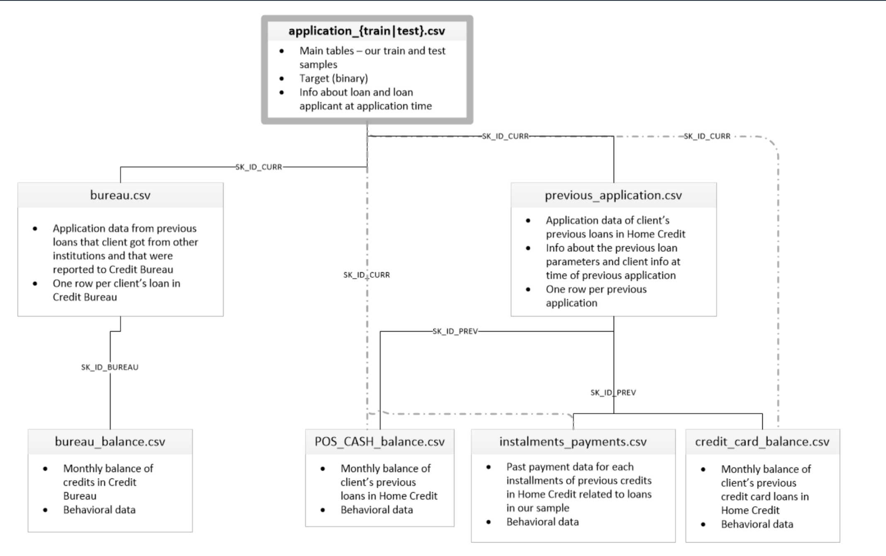

# </img> **Hopsworks Feature Store** Advanced Tutorial - Home Credit Default Risk

Many people struggle to get loans due to insufficient or non-existent credit histories. And, unfortunately, this population is often taken advantage of by untrustworthy lenders.

Home Credit strives to broaden financial inclusion for the unbanked population by providing a positive and safe borrowing experience. In order to make sure this underserved population has a positive loan experience, Home Credit makes use of a variety of alternative data--including telco and transactional information--to predict their clients' repayment abilities.

Doing so will ensure that clients capable of repayment are not rejected and that loans are given with a principal, maturity, and repayment calendar that will empower their clients to be successful.

Here you can check the data schema ⬇️

## 🗒️ This whole tutorial is divided into 5 parts:

1. How to backfill Features to the Feature Store.
2. How to create a feature pipeline.
3. How to create Feature views & Training Datasets.
4. How to train a model and upload it to the Model Registry.
5. How to fetch model from Model Registry and make batch predictions.

You will load data into the **Feature Store**, create `Feature Groups` from which you will make a `Feature View` and `Training Dataset`.

Then you will train a model to predict clients' repayment abilities. 

Also, you will design a data-generation pipeline, that will be running once a time using **GitHub Actions** and insert a new generated data into existing `Feature Groups`.

This is a batch use case, it will give you a high-level view of how to use our Python APIs and the UI to navigate.

## 👮🏻‍♂️ Prerequisites

To run this tutorial, you need an account on Hopsworks. You can create a new account at  [app.hopsworks.ai](https://app.hopsworks.ai).
In the notebook you will be prompted with a link to generate an API token to interact with your Hopsworks account.

