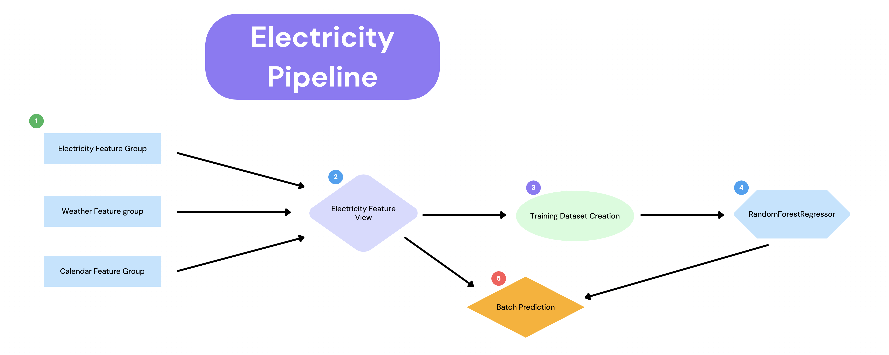
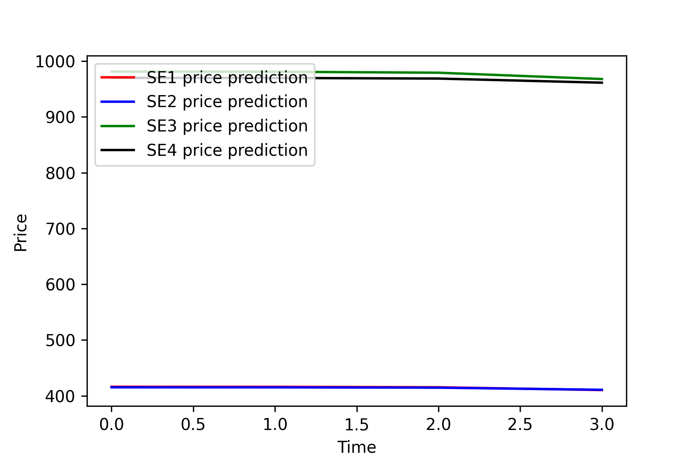

# </img> **Hopsworks Feature Store** Advanced Tutorial - Electricity Prices in Sweden

  This is an <b>advanced example</b> of the Hopsworks <a href="https://www.hopsworks.ai/feature-store">Feature Store</a> usage; you are tasked with predicting the electricity prices in several Swedish cities based on weather conditions, previous prices, and Swedish holidays.

> The [Feature Store](https://www.hopsworks.ai/feature-store) is the essential part of AI infrastructure that helps organisations bring modern enterprise data to analytical and operational ML systems. It is the simplest most powerful way to get your models to production. From anywhere, to anywhere.

  You will load starting data into the feature store, create three feature groups from which we will make a feature view and training datasets, and train a model to predict the future electricity prices.
  Also, you will design a data-parsing and Feature Store insertion pipeline, that will be running once a time using <b>GitHub actions</b>.

   This is a <b>batch use case</b>, it will give you a high-level view of how to use our python APIs and the UI to navigate the feature groups.
 

## **🗒️ This tutorial is divided into the following parts:**
1. **Feature Backfill**: How to load, engineer and create feature groups.
2. **Feature Pipeline**: How to parse new data and insert into feature groups.
3. **Training Pipeline**: How to build a feature view, training dataset split, train a model and save it in the Model Registry.
4. **Inference Pipeline**: How to retrieve a trained model from the model registry and use it for batch inference.

## Feature Pipeline

## Prerequisites
To run this tutorial, you need an account on Hopsworks. You can create a new account at  [app.hopsworks.ai](https://app.hopsworks.ai).
In the notebook you will be prompted with a link to generate an API token to interact with your Hopsworks account.

## Data
You will parse electricity prices in Sweden per day from  [Nord Pool](https://www.nordpoolgroup.com/) and different meteorological observations from [Swedish Meteorological and Hydrological Institute](https://www.smhi.se/).
See corresponding functions in the [functions.py](https://github.com/logicalclocks/hopsworks-tutorials/blob/master/advanced_tutorials/electricity/functions.py).

## Prediction example

