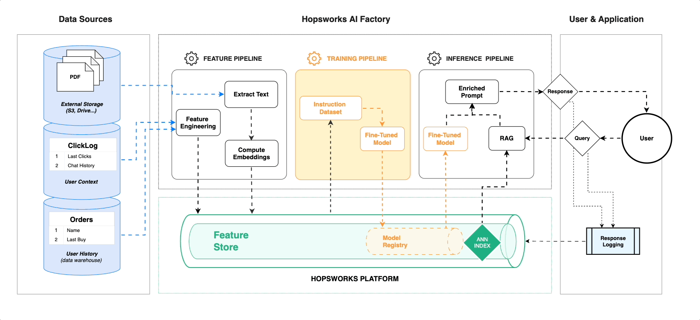

# ⚙️ Index Private PDFs for RAG and create Fine-Tuning Datasets from them

This project will take a google drive folder of PDF files that you provide and read them, index them in vector embeddings in Hopsworks for retrieval augmented generation (RAG) and create an instruction dataset for fine-tuning using a teacher model (GPT).

## 📖 Feature Pipeline
The Feature Pipeline does the following:

 * Download any new PDFs from the google drive.
 * Extract chunks of text from the PDFs and store them in a Feature Group in Hopsworks.
 * Use GPT to generate an instruction set for the fine-tuning  a foundation LLM and store as a feature group in Hopsworks.

## 🏃🏻‍♂️Training Pipeline
The Training Pipeline does the following:

 * Uses the instruction dataset and LoRA to fine-tune the open-source LLM (Mistral-7 by default) .
 * Saves the fine-tuned model to Hopsworks Model Registry.

## 🚀 Inference Pipeline
* A chatbot written in Streamlit that answers questions about the PDFs you uploaded using RAG and an embedded LLM.

## 🕵🏻‍♂️ Google Drive Credentials Creation

To create your Google Drive credentials, please follow the steps outlined in this guide: [Google Drive API Quickstart with Python](https://developers.google.com/drive/api/quickstart/python). This guide will walk you through setting up your project and downloading the necessary credentials files.

After completing the setup, you will have two files: `credentials.json` and `client_secret.json`. These are your authentication files from your Google Cloud account.

Next, integrate these files into your project:

1. Create a directory named `credentials` at the root of your forked repository.

2. Place both `credentials.json` and `client_secret.json` files inside this credentials directory.

Now, you are ready to download your PDFs from the Google Drive!
