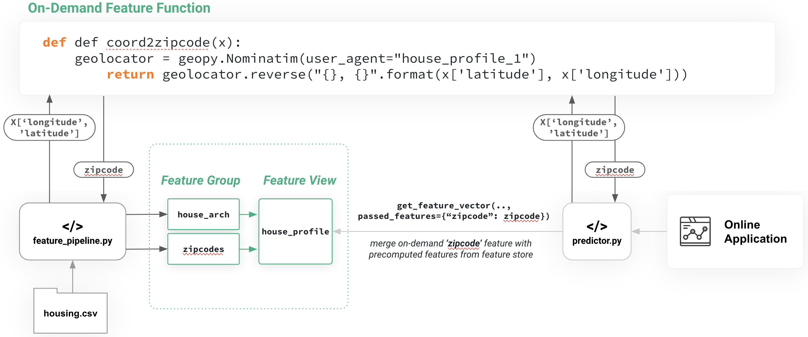

## on-demand feature in Hopsworks

This example shows how to implement an on-demand feature in Hopsworks - that is, a feature that is computed at  
request-time using application-supplied inputs for an online model .

We use a house-price estimated dataset/model to demonstrate how to implement an on-demand feature.
The on-demand feature here is the zipcode (or postcode) that is computed using longitude/latitude parameters. In our online application, longitude and latitude are provided as parameters to the application, and the same Python function used to calculate the zipcode in the feature pipeline is used to compute the zipcode in the Online Inference pipeline. This is achieved by implementing the on-demand features as a Python function in a Python module. We then ensure that the same version of the Python module is installed in both the feature and inference pipelines.




## Directory Structure
```
├── LICENSE
├── README.md          <- README explains this Python module to both developers and users.
│
├── notebooks          <- Jupyter notebooks. Naming convention is a number (for ordering),
│   └── my_module      <- A symbolic link to the 'my_module' directory
│                         On Linux/Mac: cd notebooks ; ln -s ../my_module .
│
├── requirements.txt   <- The requirements file for creating the Python environment. Install in a venv/conda environment.
│                         `conda activate my_env`
│                         my_env> `pip install -r requirements.txt`
│
├── setup.py           <- Make this project pip installable with `pip install -e`
├── my_module          <- Source code for this project.
│   ├── __init__.py    <- Makes a Python module
│   │
│   ├── pipelines      <- Feature pipelines, training pipelines, batch inference pipelines.
│   │   │── feature_pipeline.py
│   │   │── training_pipeline.py
│   │   └── batch_inference_pipeline.py
│   │
│   ├── features       <- Python modules to turn raw data into features for use in both training and inference
│   │   └── my_features.py
│   │
└── scripts            <- Bash scripts for the project
```