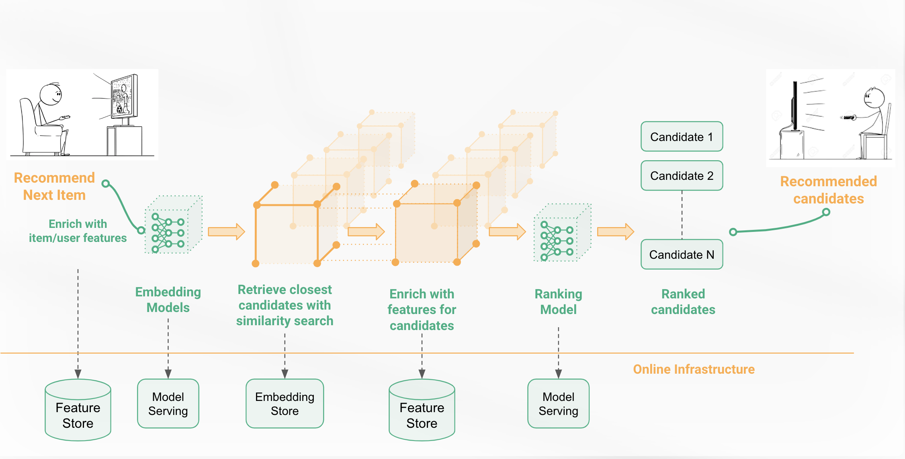
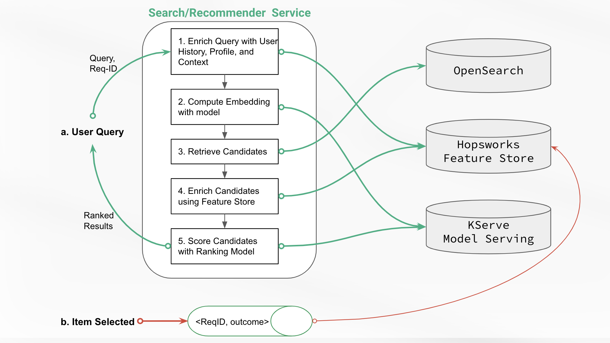

# Recommender and Personalized Search Retrieval and Ranking System
#### Recommender systems and personalized search systems are information filtering systems that personalize the information coming to a user based on her historical interests, the relevance of the information, and the current context (e.g., what is trending).

## Building Recommender and Personalized Search Retrieval and Ranking Systems using Hopsworks

## Building Recommender and Personalized Search Retrieval and Ranking Systems using Hopsworks

#### In this tutorial, you will build a recommender system for fashion items Using Hopsworks. It is divided into the following parts:

* 1_feature_engineering.ipynb
* 2a_create_retrieval_dataset.ipynb
* 2b_train_retrieval_model.ipynb
* 3_build_index.ipynb
* 4a_create_ranking_dataset.ipynb
* 4b_train_ranking_model.ipynb
* 5_create_deployments.ipynb

## Before you begin
For the tutorials to work, you need:
- Hopsworks account
  [managed.hopsworks.ai](https://managed.hopsworks.ai) account or on premise Hopsworks deployment. Note that this tutorial
  will not work for [app.hopsworks.ai](https://app.hopsworks.ai) account as submitting custom jobs to
  [app.hopsworks.ai](https://app.hopsworks.ai) are not supported.

You can find documentation on how to get started on [GCP](https://docs.hopsworks.ai/3.1/setup_installation/gcp/getting_started/),
[AWS](https://docs.hopsworks.ai/3.1/setup_installation/aws/getting_started/) or on [Azure](https://docs.hopsworks.ai/3.1/setup_installation/azure/getting_started/).

