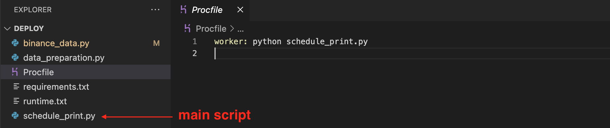
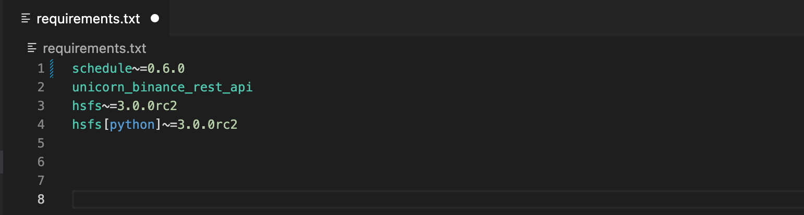
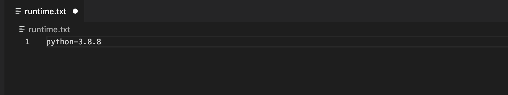
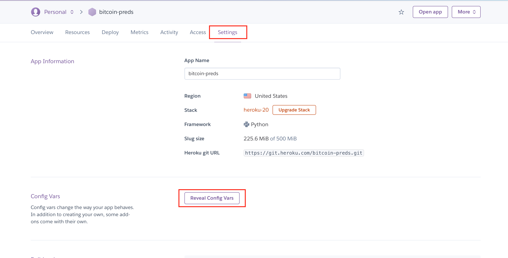
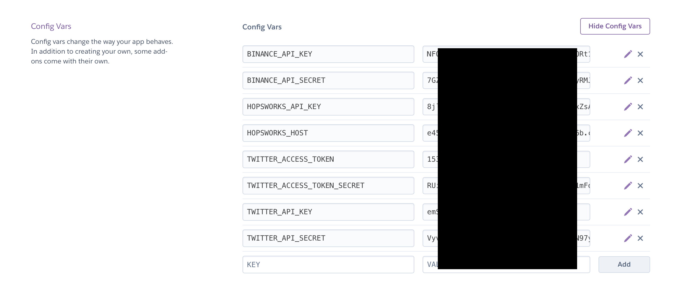

# ⚪️🟣 🚀 Deploying project using Heroku

### 🤔 What is Heroku?
---

Heroku is a cloud platform that lets you build, deliver, monitor and scale apps.

It is a way to run your script rather than executing the script from your local machine.

### 🔬 🧬 Project Creation
---
First of all we need to prepare our project for Heroku.

It should have 3 specific files besides your Python script:

- **Procfile**
- **Requirements.txt**
- **Runtime.txt**

#### ⛳️ Procfile
In this file we specify the name of a main script which Heroku should run.

#### ⛳️ Requirements.txt

In this file we specify the correct versions of the required Python libraries to run your Python code.

#### ⛳️ Runtime.txt

In this file we can define our Python (or other languages) version that we are going to use in our project.

## 🪄 Heroku Setup

1. Create Heroku account. (https://signup.heroku.com/login).
2. Install the Heroku CLI on your Computer (https://devcenter.heroku.com/articles/heroku-cli).

## 📝 Api Keys Preparation

You can securely save Api Keys using Heroku UI and then easily access them in code.

##  🚀 Deploying to Heroku

Now, it is time to deploy our project to Heroku.

Open project folder on Command Line Interface (CLI). Inside your environment use the following commands:

- `heroku login`

- `heroku create YOUR_APP_NAME`

- `git init`

- `git add .`

- `git commit -m "Great commit"`

- `git push heroku master `

To display an output of project - use next command:

- `heroku logs -t -s app -a YOUR_APP_NAME`

---

### 🕵🏻‍♂️ If you don't see any output check if worker is turned on

---
