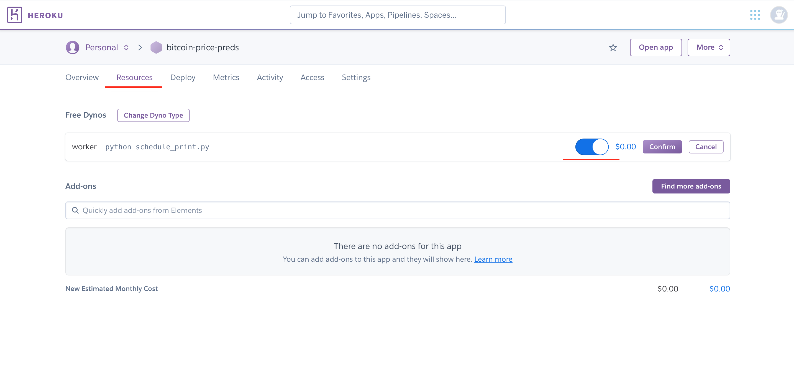

# 📈💰 Bitcoin Price Prediction using tweets data from __Twitter__ and timeseries BTC data from __Binance__

---
#### 📜 Here you can find:

##### 1. Notebooks:
  * __1.1 BTC_Parsing.ipynb__ - Data parsing from Binance
  * __1.2 Tweets_Parsing.ipynb__ -Tweets parsing from Twitter
  * __2.1 BTC_Data_Analysis.ipynb__ - Analysis of BTC historical data
  * __3.1 BTC_Feature_Engineering.ipynb__ - BTC data Feature Engineering
  * __3.2 Tweets_dataset_preprocessing.ipynb__ - Preprocessing of the Kaggle dataset (the python script with recent tweets parsing is located in _'streamlit/tweets_parsing.py'_)
  * __4.1 Tweets_applying_VADER.ipynb__
  * __4.2 Tweets_applying_Textblob.ipynb__
  * __5.0 Feature_Groups_FV_Training_DS_Creation.ipynb__ - Feature Groups, Feature View and Dataset creation (using Hopsworks API)
  * __6.0 Modeling.ipynb__ - Modeling stage.

##### 2. Streamlit app (go to the _"streamlit/"_):
  * __btc_data_parsing.py__ - functions for efficient BTC data parsing
  * __btc_data_processing.py__ - functions for efficient BTC data processing (Feature Engineering)
  * __plots.py__ - plots
  * __settings.py__ - some setting for the Streamlit and Heroku
  * __streamlit_app.py__ - Streamlit python script itself
  * __tweets_parsing.py__ - functions for tweets parsing
  * __tweets_processing.py__ - functions for tweets preprocessing, VADER and Textblob algorithms applying

# 🖠Requirements
#### For notebooks and Streamlit App
##### 1. Please install all dependencies from _requirements.txt_:
  * `pip install -r requirements.txt`
##### 2. Get [Hopsworks App account](https://app.hopsworks.ai/)
##### 3. Also don't forget to create an __.env__ configuration files (in the root dir (where all the notebooks are) and in the "/streamlit" dir), where all the necessary environment variables are stored:

#####   * _yes, you should contact Twitter for API keys and make an account on Binance to be able use their REST API's._

---

# 🌠 Running the Streamlit App
Streamlit lets you turn data scripts into shareable web apps in minutes, not weeks. It’s all Python, open-source, and free! And once you’ve created an app you can use our cloud platform to deploy, manage, and share your app!

---
## 🔌 Launching the App
1. `cd streamlit/`
2. `python -m streamlit streamlit_app.py`
3. And that's all! Streamlit will appear on http://localhost:8502/.

---
## 📸 Streamlit examples

---

# ⚪️🟣 Deploying project using Heroku

### 🤔 What is Heroku?

Heroku is a cloud platform that lets you build, deliver, monitor and scale apps.

It is a way to run your script rather than executing the script from your local machine.

---

### 🔖 Project Creation
First of all we need to prepare our project for Heroku.

It should have 3 specific files besides your Python script:

- **Procfile**
- **requirements.txt**
- **runtime.txt**

#### ⛳️ Procfile
In this file we specify the name of a main script which Heroku should run.

#### ⛳️ requirements.txt

In this file we specify the correct versions of the required Python libraries to run your Python code.

#### ⛳️ runtime.txt

In this file we can define our Python (or other languages) version that we are going to use in our project.

---
## 🪄 Heroku Setup

1. Create Heroku account. (https://signup.heroku.com/login).
2. Install the Heroku CLI on your Computer (https://devcenter.heroku.com/articles/heroku-cli).

---

## 📠Api Keys Preparation

You can securely save Api Keys using Heroku UI and then easily access them in code.

---

##  🚀 Deploying to Heroku

Now, it is time to deploy our project to Heroku.

Open project folder on Command Line Interface (CLI). Inside your environment use the following commands:

- `heroku login`

- `heroku create YOUR_APP_NAME`

- `git init`

- `git add .`

- `git commit -m "Great commit"`

- `git push heroku master `

To display an output of project - use next command:

- `heroku logs -t -s app -a YOUR_APP_NAME`

---

### 🕵🏻‍♂️ If you don't see any output check if worker is turned on

---
