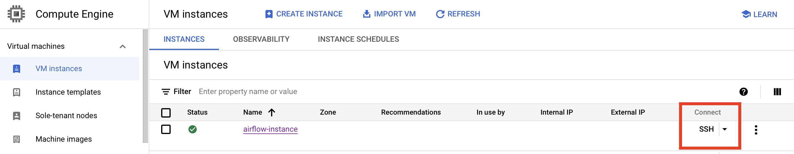
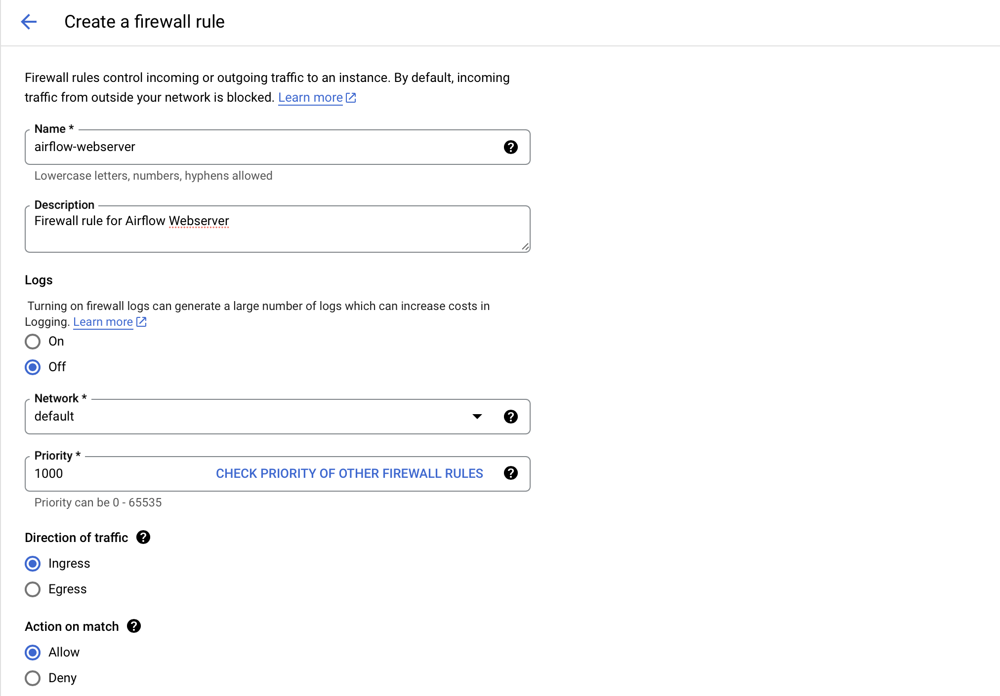
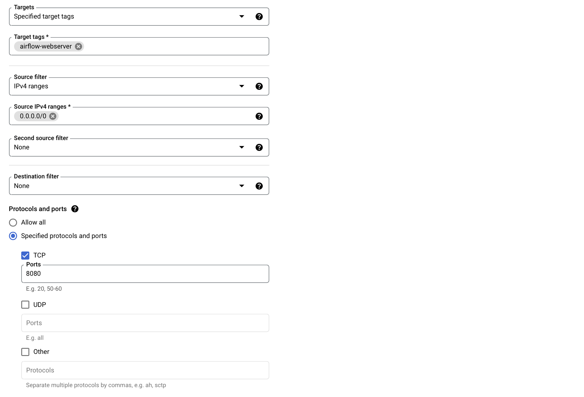
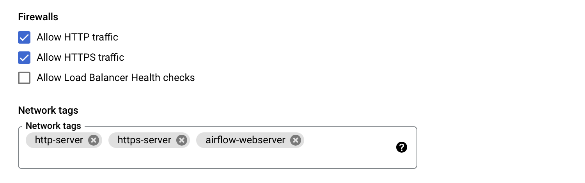
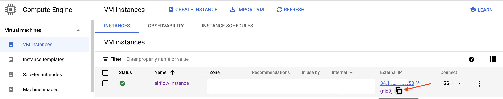
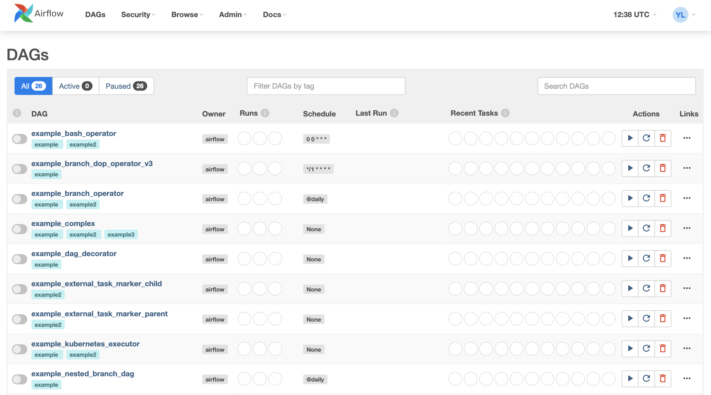
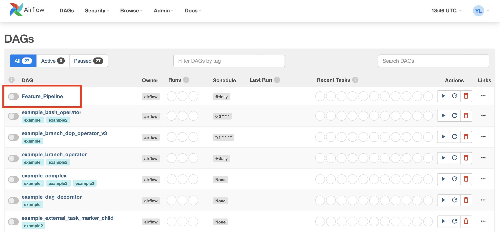
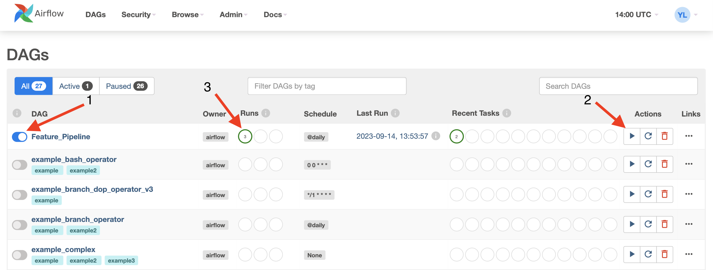

## <span style='color:#ff5f27'> 👨🏻‍🏫 Airflow Tutorial with GCP </span>

This tutorial shows how to schedule a Feature Pipeline using Airflow with GCP. 

Apache Airflow is an open-source platform used for orchestrating complex workflows and data pipelines. It provides a framework for defining, scheduling, and monitoring workflows as directed acyclic graphs (DAGs). Airflow is often used for automating and managing data ETL (Extract, Transform, Load) processes, data pipelines, and other batch or stream processing tasks.

Feature Pipeline consists of two steps:

1. Parse weather data.

2. Insert parsed data into Hopsworks Feature Group.

You will schedule your Feature Pipeline to run daily.

### <span style='color:#ff5f27'> 🏡 Service Account Setup </span>

To create a service account follow the next navigation: IAM & Admin → Service Accounts → Create Service Account.

Grant your service account the next roles:

- Dataflow Worker

### <span style='color:#ff5f27'> 🏡 VM instance Setup </span>

You can find the code to create the VM instance in the `provision.sh`.

Update `provision.sh` with your information.

To make `provision.sh` file executable, run the following command:

`chmod +x provision.sh`

Fill in your cluster information and then run the `./provision.sh` command.

Now you should see your cluster. Press `SSH connect` to open a terminal.



Type `python3 -V` to make sure everything is correct.

The next step is to install miniconda and create a virtual environment.

Paste the next command in your instance terminal:

```
mkdir -p ~/miniconda3 
wget https://repo.anaconda.com/miniconda/Miniconda3-latest-Linux-x86_64.sh -O ~/miniconda3/miniconda.sh 
bash ~/miniconda3/miniconda.sh -b -u -p ~/miniconda3 
rm -rf ~/miniconda3/miniconda.sh 
~/miniconda3/bin/conda init bash 
~/miniconda3/bin/conda init zsh
```

> ⚠️ Close your terminal and open a new one.

Now you can create a virtual environment and activate it. Paste the next command in your instance terminal:

```
mkdir airflow
cd airflow 
conda create --name airflow python=3.8 -y
conda activate airflow
```

#### <span style='color:#ff5f27'>⚙️ Airflow Installation </span>

The next step is Airflow installation. Paste the next command in your instance terminal:

```
AIRFLOW_VERSION=2.0.1
PYTHON_VERSION=3.8
CONSTRAINT_URL="https://raw.githubusercontent.com/apache/airflow/constraints-${AIRFLOW_VERSION}/constraints-${PYTHON_VERSION}.txt"
pip install "apache-airflow[gcp]==${AIRFLOW_VERSION}" --constraint "${CONSTRAINT_URL}"
```

To make sure that Airflow is correctly installed, use the `airflow version` command.

#### <span style='color:#ff5f27'>⚙️ Hopsworks Installation </span>

To begin with, you need to install the "build-essential" package, which is a metapackage that includes a collection of essential development tools and libraries. 

Run the next command in your instance terminal:

```
sudo apt-get update -y
sudo apt-get install build-essential
```

The next step is the installation of the **twofish** and **hopsworks** packages. Run the next command:

```
pip install twofish
pip install hopsworks
```

To verify that the **hopsworks** library is correctly installed, use the next command:

`pip show hopsworks`

Great, your VM instance is ready! 📈 🎉

### <span style='color:#ff5f27'>🗄️ Init metadata database and register the admin user </span>

Run the next command to init a database and register the admin user:

```
airflow db init
airflow users create -r Admin -u username -p mypassword -e example@mail.com -f yourname -l lastname
```

### <span style='color:#ff5f27'>🛠️ Airflow Setup </span>

To be able to access the Airflow webserver you need to **open the 8080 port**.

Go to the **VPS Network -> Firewall -> Create Firewall Rule**.





Press the **Create** button.

Go to **Compute Engine -> VM instances** and click on your instance.

Then press the **Edit** button and add the firewall rule you created.



Go back to the terminal and start the Web Server using the next command:

`airflow webserver -p 8080`

> ⚠️ Leave your terminal running and open a new one.

Now you need to start the Scheduler. The scheduler ensures that tasks run in the correct order and at the right time.

```
cd airflow 
AIRFLOW_HOME=$(pwd)
export AIRFLOW_HOME=$AIRFLOW_HOME 
conda activate airflow
airflow db init
airflow scheduler
```

The next step is to copy the external IP of your instance to your clipboard.



On your browser go to the `https://{YOUR_INSTANCE_EXTERNAL_IP}:8080`.

Login with the user and password you have created when the DB was initialized.



Congratulations, your Airflow Webserver is ready! 🥳 📈

The next step is to prepare a DAG with tasks for Feature Pipeline.

### <span style='color:#ff5f27'> 📝 DAG Setup </span>

You can find the code to create the DAG with tasks for Feature Pipeline in the `data_parsing.py` file which is located in the `dags` folder.

Open your code editor to edit `data_parsing.py` file and replace `{YOUR_HOPSWORKS_API_KEY}` with your `HOPSWORKS_API_KEY` which you can get on [Hopsworks App](https://app.hopsworks.ai/login).

To upload this file to the cluster open a new terminal and press **Upload File**. Choose the `data_parsing.py` and press **Upload Files**.

To ensure that file is uploaded use the `ls` command. The `data_parsing.py` should be present there.

The next step is to create a **dags** folder and move `data_parsing.py` file there. Use the next command:

```
conda activate airflow
cd airflow
mkdir dags
cd ..
mv data_parsing.py airflow/dags
```

Refresh your Airflow UI page. Now you should see newly created **Feature_Pipeline** DAG.



> In case you don't see your DAG, just wait a moment for it to refresh.

Activate(1) the **Feature_Pipeline** DAG and then trigger(2) it. The green circle(3) means that run was successful.



Congratulations! You successfully scheduled your Feature Pipeline using Airflow with GCP! 🥳 🎉