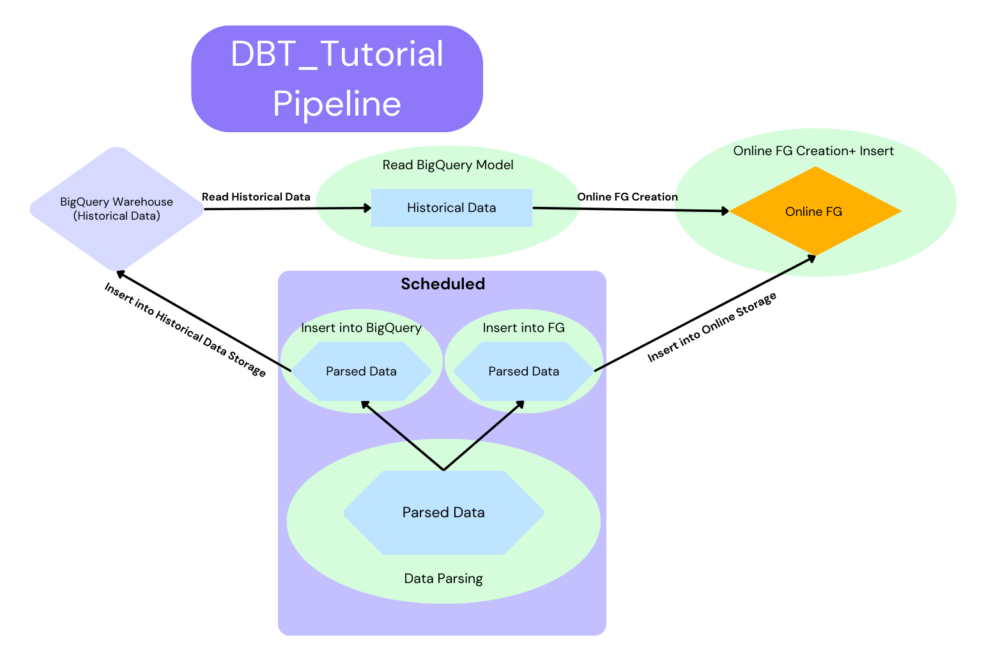
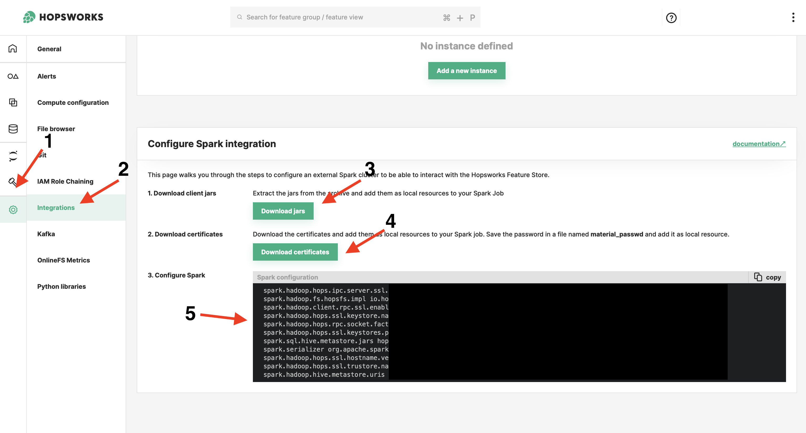

<!-- #region -->
##  👨🏻‍🏫 DBT Tutorial with BigQuery 

This tutorial shows you how to perform feature engineering in DBT on BigQuery, storing offline computed features in a table in BigQuery (that is mounted as an external feature group in Hopsworks) and online features in Hopsworks. The online features are written to Hopsworks using a Python module that is run on a DataProc cluster. The feature group created in Hopsworks has its offline data stored in BigQuery and its online data stored in Hopsworks online store (RonDB).

###  🔮 Hopsworks BigQuery Storage Connector Setup 

Follow this [guide](https://docs.hopsworks.ai/3.0/user_guides/fs/storage_connector/creation/bigquery/) to set up a connection to BigQuery.

###  🏡 Dataproc Cluster Setup 

First, you need to setup a Dataproc (Spark) cluster that will run the Python model in our DBT workflow. The Python model will write to the online feature store in Hopsworks.

Dataproc cluster needs to be deployed in the same subnet as Hopsworks or Hopsworks and Dataproc networks needs to be VPC peered so that resources in each network can communicate with each other. (You can read more about VPC-Peering [here](https://cloud.google.com/vpc/docs/vpc-peering))

Navigate to **Project Settings** and then **Integrations**. At the bottom of the page you will find necessary files which you need to attach to your Dataproc cluster.

You need to untar the downloaded archive and upload the resulting files to your GCS bucket.

In addition, upload downloaded certificates to the **client** folder where JARs are located.

You can find the code to create the Dataproc cluster in `provision.sh`.

To make `provision.sh` file executable, run the following command:

`chmod +x provision.sh`

You can find the code to configure your Spark in `configureSpark.sh`. Fill in your information and upload `configureSpark.sh` to your GCS bucket.

Fill in your cluster information and then run the `./provision.sh` command.

### 👩🏻‍🔬 GCP Service account setup 

To create a service account follow the next navigation: IAM & Admin → Service Accounts → Create Service Account.

Grant your service account the next roles:

- BigQuery Admin
- Dataproc Administrator
- Editor
- Storage Admin

### 👔 DBT Setup 

To schedule a DBT model you will use the DBT Cloud Platform.

To begin with, register on the [DBT Cloud page](https://cloud.getdbt.com).

Next, you need to set up a new project. Name it and press continue.

Choose the BigQuery connection.

Then upload your **Service Account JSON file**, define a Google Cloud **Storage Bucket name**, **Dataproc Region** and **Dataproc Cluster name**.

Press **Test Connection**.

To setup a repository, select GitHub option and choose a repository with your DBT tutorial project.

Great! Your project is ready!📈

###  🏃🏻‍♂️ Run DBT 

Fill in `read_bigquery_data.sql`, `data_pipeline.py` files with your feature engineering code and push changes on your GitHub repository.

Use the next command in the DBT terminal to run DBT models pipeline:

`dbt run`

> To see the job logs, check your Dataproc cluster **Job details**.

### ⏰ DBT Job Schedule 

Press the `Deploy` button at the top left corner and then press `Environments`.

Create a new environment, pass environment name and BigQuery table name where DBT models will be stored. Press **Save**.

Press `Create Job` button.

Add job name, select environment. In `Run Timeout` pass **900**.

In `Commands` pass the next: `dbt build --select data_pipeline+`. 

This command will run `data_pipeline` model and all models that follow it in order.

Then select `Run on Schedule` and choose the desired schedule.

Press `Save` and that's it!

Now your feature pipeline is scheduled.