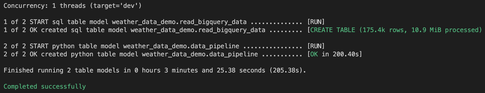

## <span style='color:#ff5f27'> 👨🏻‍🏫 DBT Tutorial with BigQuery </span>

### <span style='color:#ff5f27'> 🏡 Cluster setup </span>

To begin with, setup the Dataproc cluster.

Code to create Dataproc cluster is present in `provision.sh` file.

To make `provision.sh` file executable do the next:

`chmod +x provision.sh`

Fill in your cluster information and then use `./provision.sh` command to start the cluster creation.

### <span style='color:#ff5f27'>📡 DBT Setup </span>

Install the BigQuery adapter running:
`pip install dbt-bigquery`

Create a new profile inside your ~/.dbt/profiles.yml file.

```
{YOUR_PROJECT_NAME}:
 target: dev
 outputs:
   dev:
     type: bigquery
     method: service-account-json
     project: [your-project-id]
     dataset: {YOUR_DATASET_NAME}
     threads: 1


     # These fields come from the service account json keyfile
     keyfile_json:
       type: xxx
       project_id: xxx
       private_key_id: xxx
       private_key: xxx
       client_email: xxx
       client_id: xxx
       auth_uri: xxx
       token_uri: xxx
       auth_provider_x509_cert_url: xxx
       client_x509_cert_url: xxx


     # for dbt Python models
     gcs_bucket: {YOUR_BUCKET_NAME}
     dataproc_region: {YOUR_DATAPROC_REGION} 
 ```

### <span style='color:#ff5f27'>👩🏻‍🔬 Cluster Setup </span>

```
spark.hadoop.hops.ipc.server.ssl.enabled true
spark.hadoop.fs.hopsfs.impl io.hops.hopsfs.client.HopsFileSystem
spark.hadoop.client.rpc.ssl.enabled.protocol TLSv1.2
spark.hadoop.hops.ssl.keystore.name keyStore.jks
spark.hadoop.hops.rpc.socket.factory.class.default io.hops.hadoop.shaded.org.ap$
spark.hadoop.hops.ssl.keystores.passwd.name /etc/spark/conf/material_passwd
spark.sql.hive.metastore.jars hopsworks_jars/apache-hive/lib*
spark.serializer org.apache.spark.serializer.KryoSerializer
spark.hadoop.hops.ssl.hostname.verifier ALLOW_ALL
spark.hadoop.hops.ssl.trustore.name trustStore.jks
spark.hadoop.hive.metastore.uris thrift://172.16.4.66:9083
```


### <span style='color:#ff5f27'>⚙️ DBT Launch </span>

Update `read_bigquery_data.sql` and `data_pipeline.py` files with your information.

Use the next command to run DBT models pipeline:

`dbt run`

You will see the next output:


Check your cluster **Job details** to see the job logs.

```python

```
