# 🧙🏻‍♂️ Machine Learning Pipelines with Mage.ai and Hopsworks

Mage.ai is an open-source platform for orchestrating data and machine learning pipelines. Hopsworks is a ML infrastructure platform. You can run your feature, training, and inference pipelines on Mage.ai and get the benefits of visualization, debugging, and so on.


## ⬇️ Installation


Create a new Python environment for this tutorial.

Open the terminal and pass the next command:

```
git clone https://github.com/logicalclocks/hopsworks-tutorials.git
```

Go to the project folder.

```
cd hopsworks-tutorials/integrations/mage_ai
```

Install the mage-ai library:

```
pip install mage-ai
```

Install the requirements.txt

```
pip install -r requirements.txt
```

To launch the Mage tool run the next command:

```
mage start mage_tutorial
```

Open http://localhost:6789 in your browser.


## ⚙️ API Key Setup


Navigate to the Pipelines section and open the hopsworks_mage_quickstart pipeline.
Here you can find a Pipeline Tree which shows you the block flow.

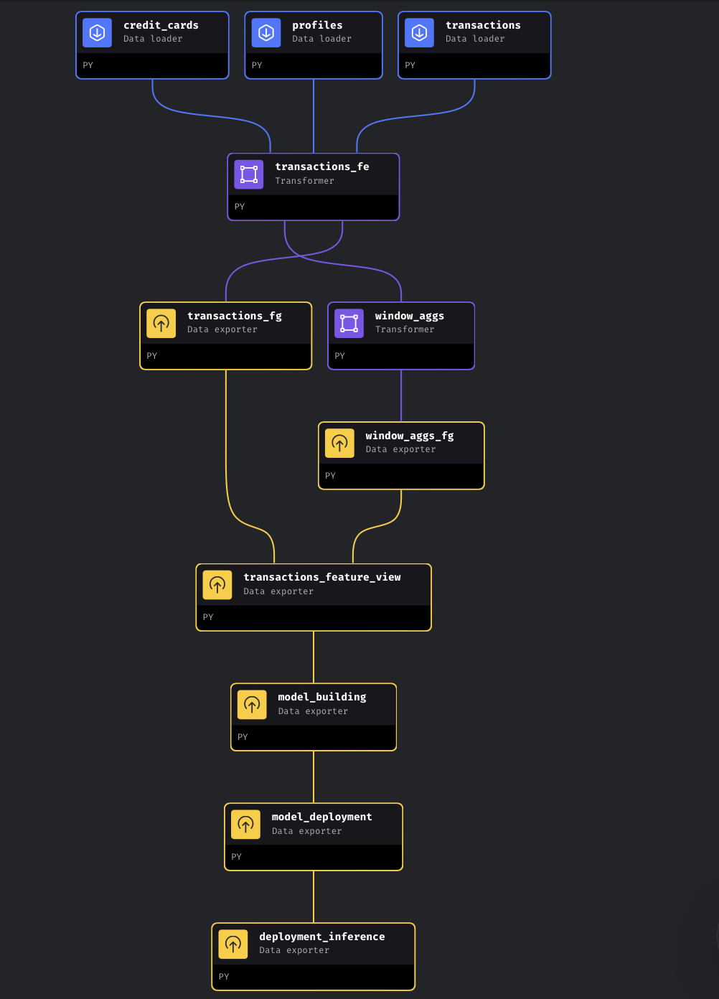

Go to the Edit Pipeline section.

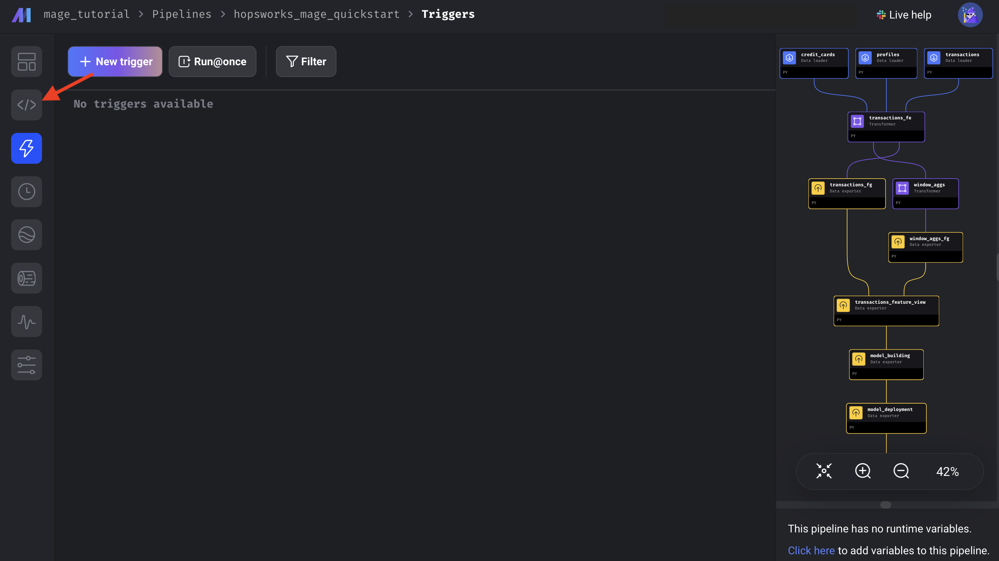


The next step is to add the Hopsworks Api key to the secrets. Open the Secrets section and press the **+New** button.

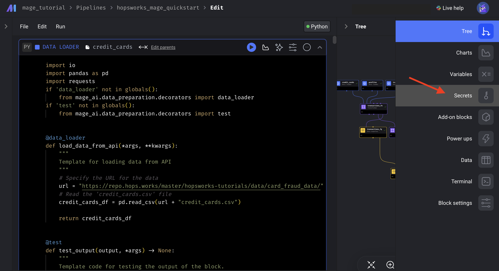


*Secret Name: HOPSWORKS_API_KEY*

*Secret Value: {YOUR_HOPSWORKS_API_KEY}*

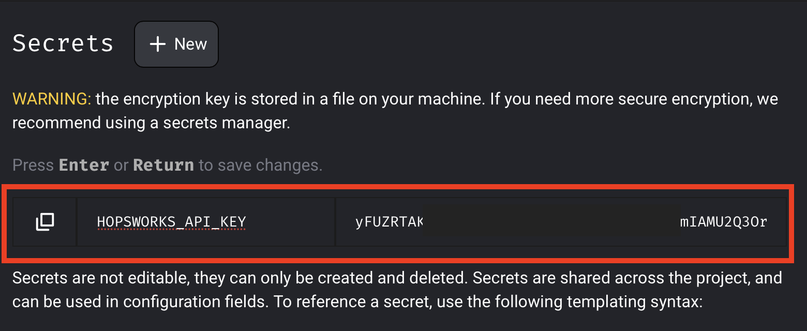

Press Enter to save the secret.

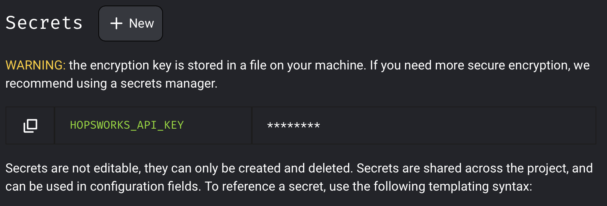

Now you are ready to run Pipeline blocks.


## 🚀 Launch

If you want to run all blocks at once, press on the last block on the blocks tree. Then press **Execute with all upstream blocks**.

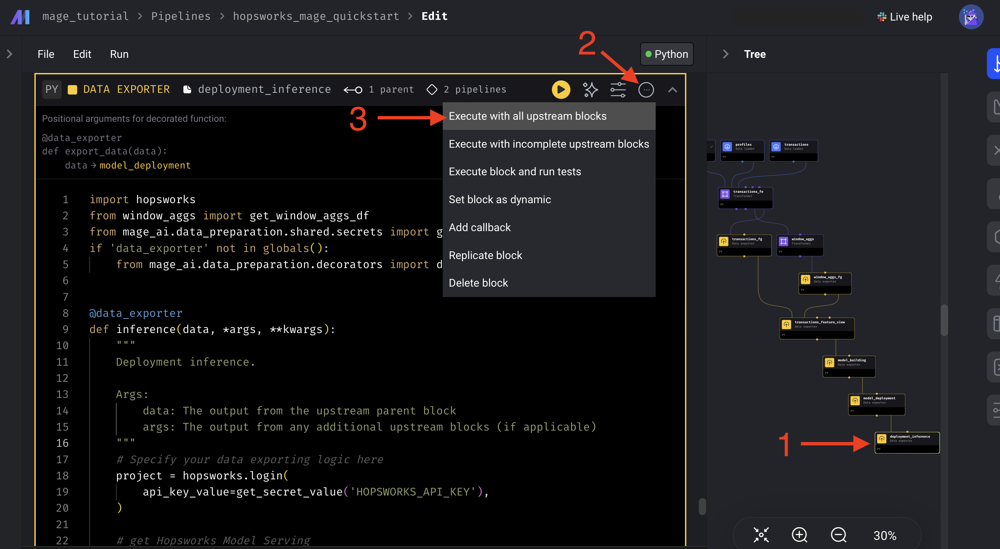


If you want to run every block step by step,  press the next button on the required block:

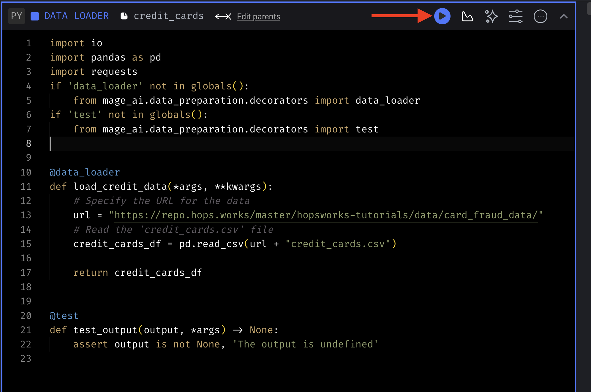

At the bottom of a block you will see the block output.

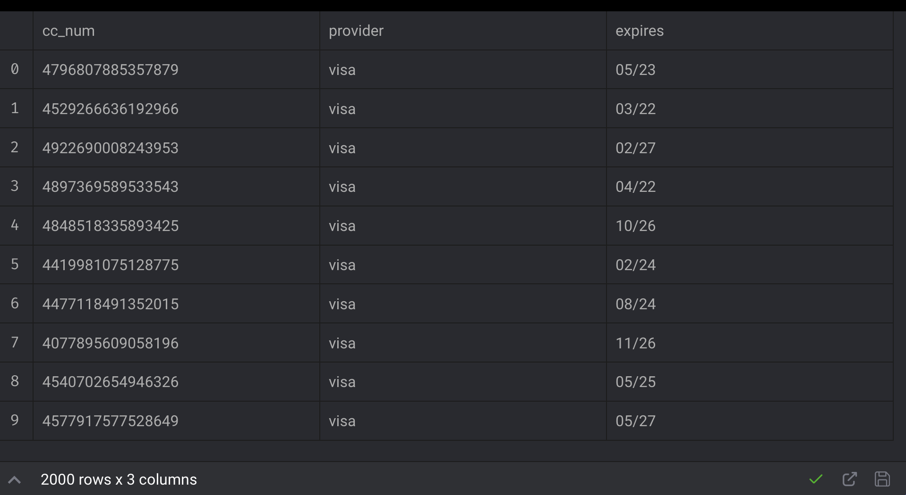


After running **transactions_fg** and **window_aggs_fg** blocks, you will see **transactions** and **transactions_4h_aggs** Feature Groups in the Hopsworks UI.

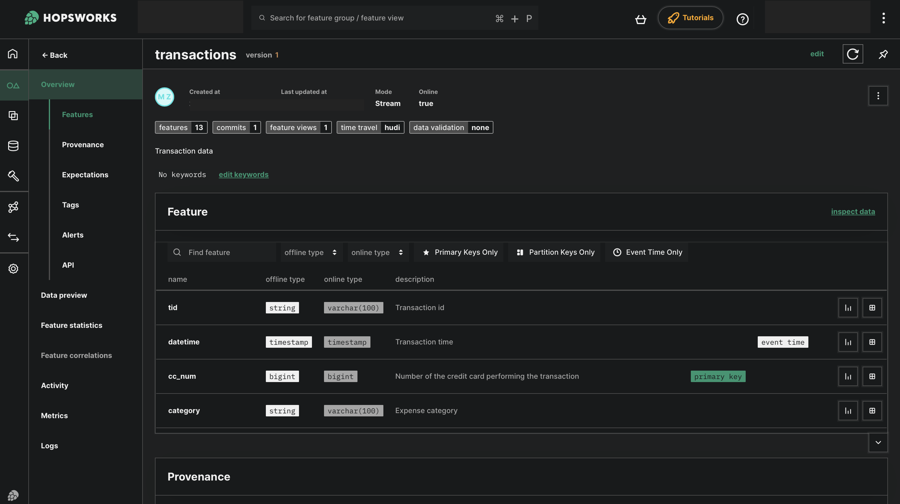

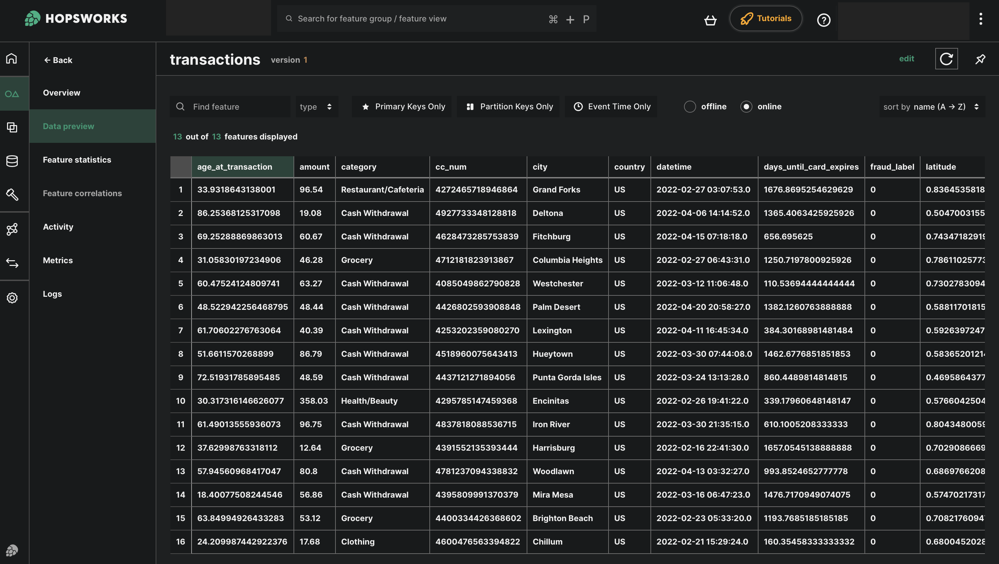

The **model_building** block trains and saves the trained model into the Hopsworks Model Registry.

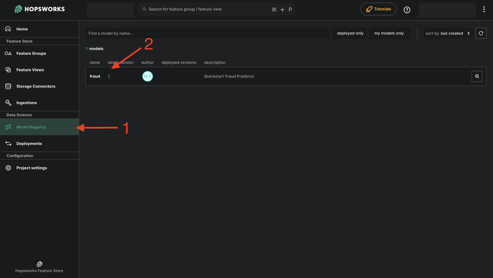

After running the **model_deployment** block, you can find your deployed model in the Hopsworks Deployments.

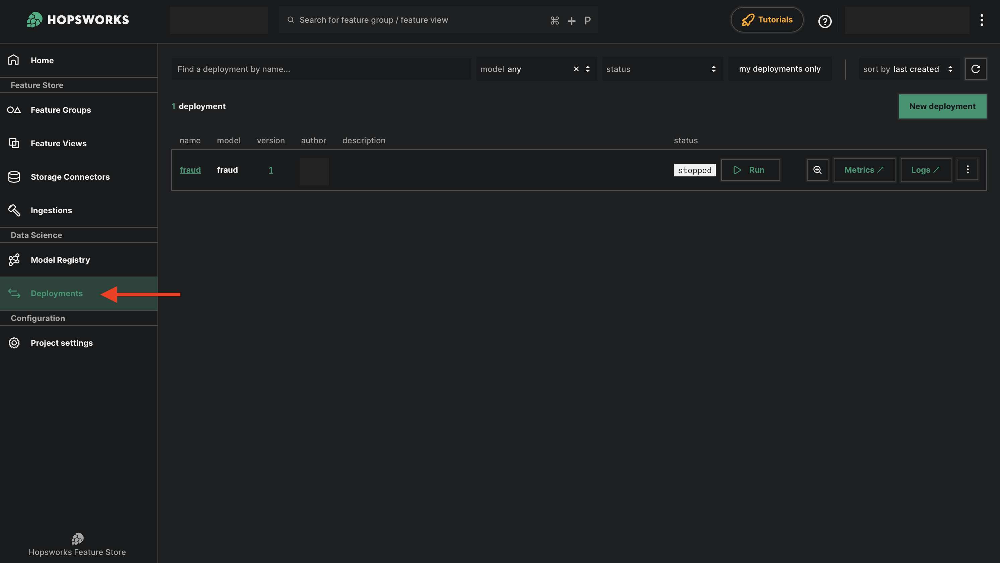

The **deployment_inference** block shows how to make online inference using your deployed model.

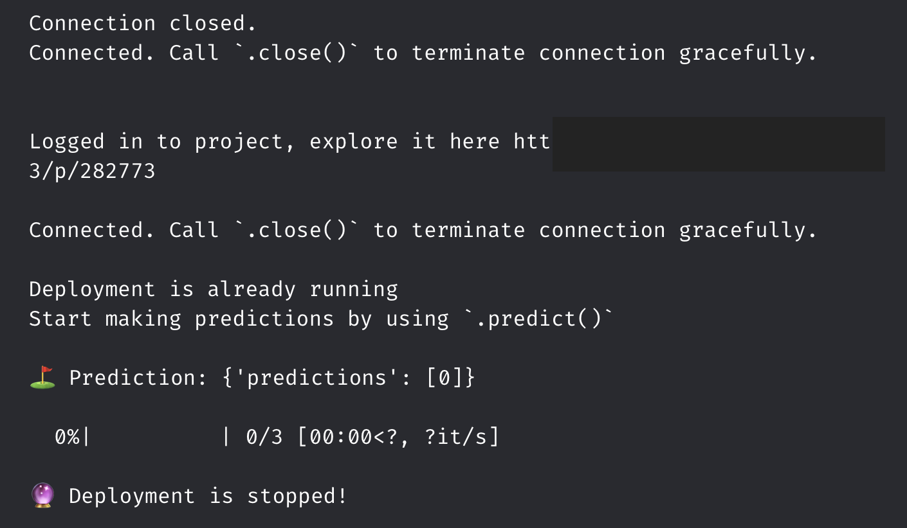
